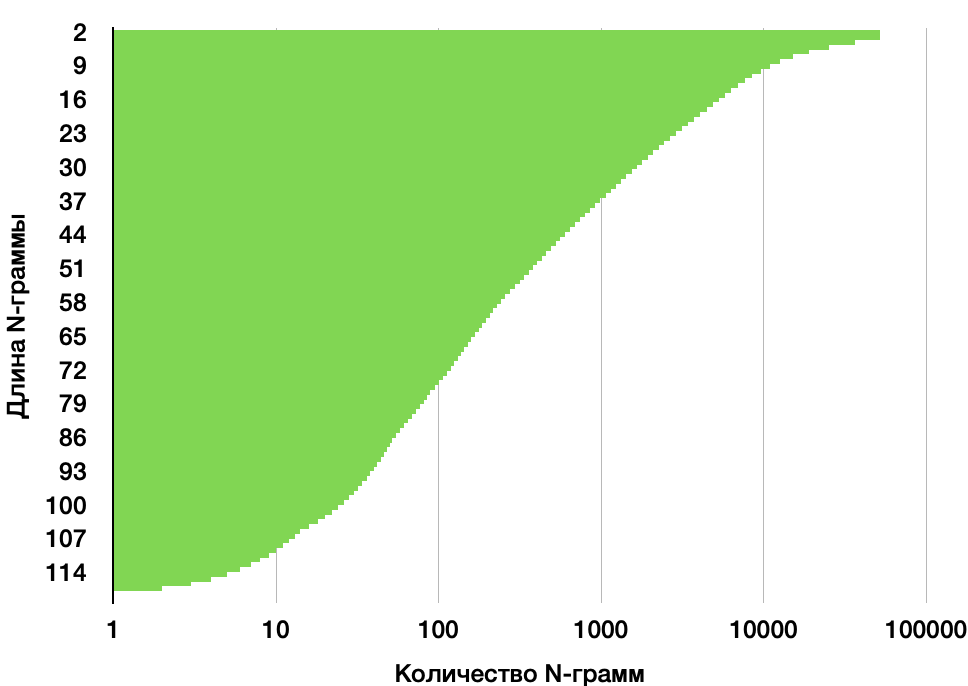

# Практическое задание №3

**Задача:** Реализовать методы извлечения N-грамм.  
**Исходный код:** https://github.com/kkmoskalenko/cl_course/tree/main/Task_3

## Результаты работы

Время работы программы: 27 секунд.

```
» «, Frequency: 728, Text frequency: 84, IDF: 2.93752
( «, Frequency: 1036, Text frequency: 259, IDF: 1.81151
» И «, Frequency: 457, Text frequency: 341, IDF: 1.53646
» , «, Frequency: 710, Text frequency: 300, IDF: 1.66456
, НЕ, Frequency: 192, Text frequency: 140, IDF: 2.4267
. ПРЕМЬЕР МАРТ . «, Frequency: 27, Text frequency: 21, IDF: 4.32382
. ПРЕМЬЕР АВГУСТ . «, Frequency: 27, Text frequency: 20, IDF: 4.37261
И ДРУГОЙ . «, Frequency: 51, Text frequency: 26, IDF: 4.11024
, ИЗВЕСТНЫЙ ПО ФИЛЬМ «, Frequency: 24, Text frequency: 23, IDF: 4.23285
» ) И, Frequency: 119, Text frequency: 90, IDF: 2.86853
. ПРЕМЬЕР ИЮНЬ . «, Frequency: 23, Text frequency: 11, IDF: 4.97044
В ИСПОЛНЕНИЕ, Frequency: 182, Text frequency: 148, IDF: 2.37113
. «, Frequency: 3387, Text frequency: 500, IDF: 1.15373
, ВЕДЬ, Frequency: 65, Text frequency: 56, IDF: 3.34299
» — ЭТО, Frequency: 107, Text frequency: 83, IDF: 2.9495
В ОЧЕРЕДНОЙ РАЗ, Frequency: 21, Text frequency: 18, IDF: 4.47797
. ПРЕМЬЕР «, Frequency: 83, Text frequency: 83, IDF: 2.9495
» ; «, Frequency: 41, Text frequency: 3, IDF: 6.26973
. ПРЕМЬЕР ИЮЛЬ . «, Frequency: 20, Text frequency: 13, IDF: 4.80339
, ЕГО, Frequency: 40, Text frequency: 39, IDF: 3.70478
И ДАЖЕ, Frequency: 60, Text frequency: 56, IDF: 3.34299
» ) . «, Frequency: 58, Text frequency: 33, IDF: 3.87183
» — БАЛЛ «, Frequency: 19, Text frequency: 1, IDF: 7.36834
ИЗ «, Frequency: 90, Text frequency: 67, IDF: 3.16365
. ПРЕМЬЕР АПРЕЛЬ . «, Frequency: 36, Text frequency: 21, IDF: 4.32382
. В КИНО С НОЯБРЬ . «, Frequency: 18, Text frequency: 17, IDF: 4.53513
. ЧТОБЫ, Frequency: 71, Text frequency: 66, IDF: 3.17868
» С, Frequency: 299, Text frequency: 235, IDF: 1.90875
, ЧТОБЫ, Frequency: 562, Text frequency: 343, IDF: 1.53061
В ОБРАЗ, Frequency: 35, Text frequency: 32, IDF: 3.9026
. ДА ,, Frequency: 52, Text frequency: 40, IDF: 3.67946
» . «, Frequency: 156, Text frequency: 102, IDF: 2.74337
. В ГЛАВНОЕ РОЛЬ —, Frequency: 17, Text frequency: 15, IDF: 4.66029
» В, Frequency: 252, Text frequency: 221, IDF: 1.97018
ОТМЕТИЛ , ЧТО, Frequency: 67, Text frequency: 64, IDF: 3.20946
, ПОЭТОМУ, Frequency: 114, Text frequency: 103, IDF: 2.73361
, ПОСКОЛЬКУ, Frequency: 32, Text frequency: 32, IDF: 3.9026
. ПРУ ЭТО ,, Frequency: 32, Text frequency: 28, IDF: 4.03614
. ПРОСТО, Frequency: 16, Text frequency: 15, IDF: 4.66029
КАРТИНА ., Frequency: 62, Text frequency: 59, IDF: 3.2908
. НО, Frequency: 524, Text frequency: 290, IDF: 1.69846
. ОНА, Frequency: 122, Text frequency: 116, IDF: 2.61475
, ЧТО, Frequency: 2217, Text frequency: 898, IDF: 0.56817
ЕЩЁ БОЛЬШЕ, Frequency: 15, Text frequency: 14, IDF: 4.72928
— У, Frequency: 15, Text frequency: 15, IDF: 4.66029
, НО НЕ, Frequency: 60, Text frequency: 55, IDF: 3.36101
, ЧТО НЕ, Frequency: 44, Text frequency: 41, IDF: 3.65477
— В, Frequency: 88, Text frequency: 78, IDF: 3.01163
, И, Frequency: 571, Text frequency: 272, IDF: 1.76254
И ЕГО, Frequency: 161, Text frequency: 130, IDF: 2.50081
СТРИМИНГОВЫЙ СЕРВИС NETFLIX, Frequency: 73, Text frequency: 45, IDF: 3.56168
```


## График зависимости

